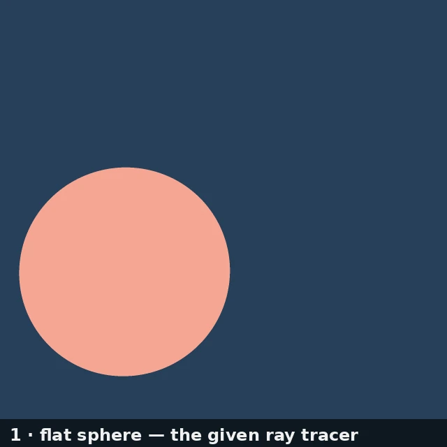
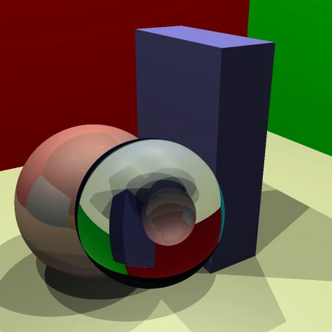
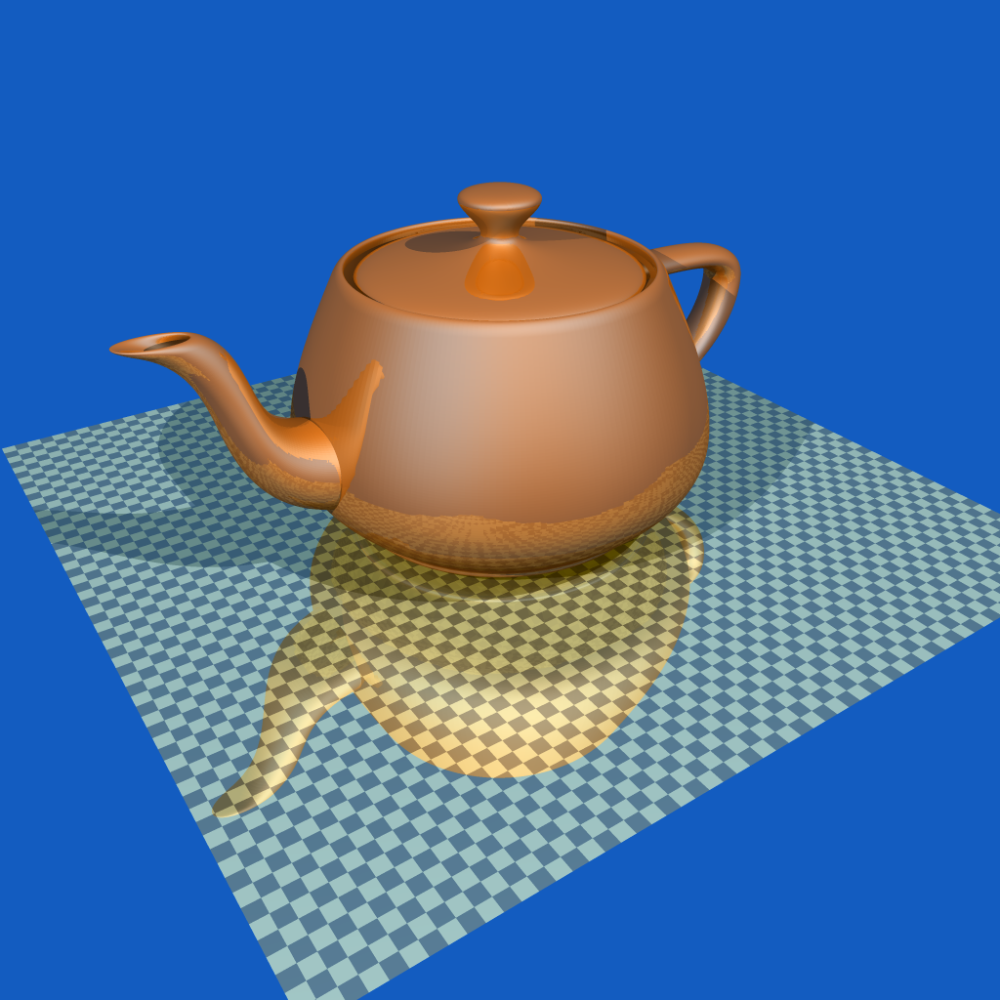

# kbToyTracer

A small Whitted-style ray tracer in C++. It began as James Arvo's **toytracer** — a teaching
kernel from EECS 204 at UC Irvine (Fall 2004) that could only intersect spheres — which I
(Kevin Brandon) extended over the course and well beyond it: boxes and triangle meshes,
reflection and refraction, affine-transformed primitives, area lights with soft shadows,
procedural and image textures, depth of field, a uniform spatial subdivision, and later a
bounding volume hierarchy. In 2026 I recovered it from an old CD and got it building and
rendering again on Linux.

<p align="center">
  
  
  
</p>

## Quick start

```sh
make                       # builds ./kbtoytracer  (needs g++ with C++17 + OpenMP)
python3 gen_all.py         # renders the whole gallery (needs Python 3 + Pillow)
```

Then open **`gallery/index.html`** in a browser (or serve the folder:
`python3 -m http.server -d gallery`). That's it — the gallery is the fastest way to
understand what the tracer does and how it's driven.

To render a single scene yourself:

```sh
./kbtoytracer scenes/scene1-reflection.sdf out.ppm kbtoytracer.cfg
```

The arguments are `<scene.sdf> [output.ppm] [config.cfg]`.

## Learning the tracer by reading the gallery scripts

The gallery is deliberately built to be a tutorial. It is split into sections, one small
script each, all sharing `gallery_lib.py`:

| Script | What it shows |
|---|---|
| `gen_class.py` | The class progression: flat sphere → box intersector → shading → shadows → specular → reflection → affine transform |
| `gen_arealights.py` | Soft shadows converging as Monte-Carlo samples go 1 → 49 |
| `gen_spheres_ellipsoids.py` | 200 spheres → ellipsoids → reflective → refractive glass, in a colored room |
| `gen_refraction.py` | A glass sphere: a depth-of-field focus rack and a sphere → lens morph |
| `gen_teapot.py` | A 229,921-triangle teapot, traced through the BVH |

Each script is a short list of `(scene, title, config-overrides)` tuples. Reading one shows
you exactly which config knobs produce which effect, and each rendered card reports the
resolution, sampling, bounce depth, and measured render time. Run a single section (e.g.
`python3 gen_arealights.py`) to re-render just that part without redoing the slow frames.

Two things worth understanding:

- **The scene format** (`scenes/*.sdf`) is plain text. A scene picks an aggregate
  (`begin List` / `begin SSub` / `begin BVH`), places lights (`point` objects with
  `emission`) and primitives (`sphere`, `box`, `triangle`, `quad`, `plane`), each followed
  by its material (`diffuse`, `specular`, `reflectivity`, `refractivity`, `index_refract`,
  `Phong_exp`, `emission`) and optional `matrix` (a 3×4 affine transform) or texture. Open
  `scenes/scene1-reflection.sdf` — it's a dozen readable lines.
- **The config** (`kbtoytracer.cfg`) holds the render settings the scene doesn't:
  resolution, anti-aliasing samples, max reflection/refraction depth, area-light sample
  count (`dlSamp`), depth-of-field lens sampling, and feature toggles. The gallery scripts
  write a fresh config per image, so you can see each setting's effect in isolation.

## Features

- **Primitives:** sphere, box, triangle, quad, plane; point lights as emissive points
- **Materials:** Lambertian diffuse, specular highlights, mirror reflection, Snell-law
  refraction with total internal reflection
- **Transforms:** any primitive can carry a 3×4 affine `matrix` (spheres → ellipsoids, etc.)
- **Lighting:** point lights, and **area lights** with Monte-Carlo soft shadows
- **Textures:** image maps, procedural marble (Perlin solid noise), checker, stripe
- **Camera:** thin-lens **depth of field** (Monte-Carlo aperture sampling)
- **Acceleration:** a **bounding volume hierarchy** (`begin BVH`, median split) and a uniform
  spatial subdivision (`begin SSub`), alongside brute-force `begin List`
- **Parallel:** the render loop is parallelized with OpenMP

## Notes

- The 229k-triangle teapot ships gzipped (`scenes/teapot-bvh-hq.sdf.gz`, 2.2 MB) and is
  decompressed automatically on first use, so the repo stays small.
- This repository contains only what's needed to build the tracer and run the gallery. The
  original texture-generation, animation, and multi-render tooling is not included here.

## Credits

The original toytracer kernel is **James Arvo's**, from EECS 204 (UC Irvine, Fall 2004). A
faithful archive of that original teaching code is preserved separately at
**github.com/kevinabrandon/arvo-toytracer-archive**. Everything layered on top of that kernel
in this repository is my own coursework and later hobby work. The convention in `src/`:
files prefixed **`kb`** are mine, unprefixed files are Arvo's — see
[PROVENANCE.md](PROVENANCE.md) for the file-by-file breakdown.
